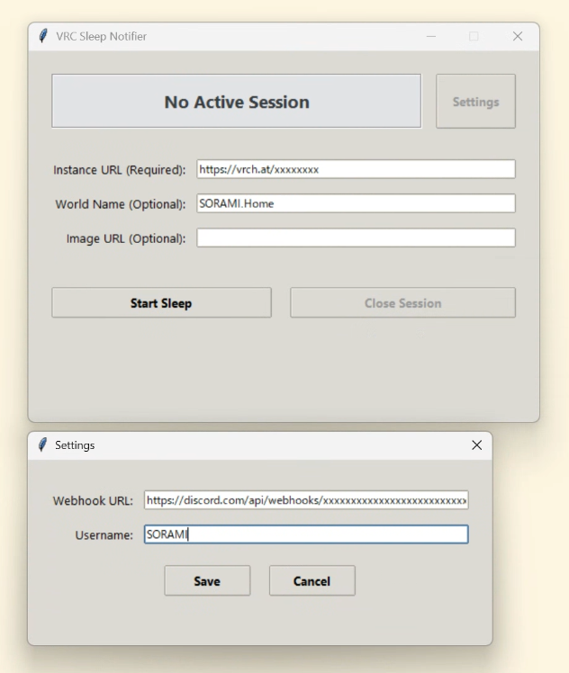

# vrc-sleep

[English](README.md) | [日本語](README.ja.md)

VRChatで寝るときにDiscordへインスタンスURLを通知し、起きたらそのメッセージを「クローズ」に書き換えるツールです。
CLIとGUI（デスクトップアプリ）の両方を提供しています。

<p align="center">
  
</p>

Pythonの標準ライブラリだけで動くので、外部パッケージのインストールは不要です。

## 動作環境

- Python 3.10 以上

## インストール

リポジトリをクローンしてそのまま実行するか、pipでインストールしてください。

```bash
git clone https://github.com/sorami-wanwan/vrc_position_nofy.git
cd vrc_position_nofy

# pipで入れる場合（vrc-sleep コマンドがどこからでも使えるようになります）
pip install .
```

## インストール・実行時の重要なお願い (Windows ユーザーへ)

本ツール（exe版）をWindows環境でご使用の際は、以下の点に必ずご注意ください。

1. **ZIPファイルは必ず「すべて展開」してから実行してください**
   ダウンロードしたZIPファイルをダブルクリックし、そのまま中身のexeファイルを実行すると、Windowsの一時フォルダ（TEMP）上で起動してしまい、設定内容が保存されません。実行前にZIPファイルを右クリックし、「すべて展開...」を選んでフォルダを取り出してから実行してください。
2. **「Windows によって PC が保護されました」と表示された場合**
   SmartScreen機能により警告画面が出ることがあります。その場合は画面内の**「詳細情報」**をクリックし、**「実行」**ボタンを押すことで起動できます。
3. **アンチウイルスソフト（Windows Defenderなど）の干渉**
   設定が保存できない、または初期化されてしまう場合は、本ツールのフォルダをアンチウイルスソフト（Windows Defenderなど）の除外リストに追加してください。
4. **安全な配置場所の指定**
   セキュリティ上、本ツールは共有フォルダやTempフォルダではなく、マイドキュメント等の信頼できる安全なディレクトリに解凍して実行してください。

## 使い方

初回のみDiscordのWebhook URL等の設定が必要です。GUI版（`vrc_sleep_gui.py`）を使用する場合は、起動後に右上の **Settings** ボタンから設定できます。

CLIの場合は以下のように `config` を実行するか、環境変数（`DISCORD_WEBHOOK_URL`, `VRC_SLEEP_USERNAME`）を使用してください。

```bash
python3 vrc_sleep.py config --webhook "https://discord.com/api/webhooks/..." --username "SORAMI"
```

### 1. 寝るとき

**GUI版**:
`python3 vrc_sleep_gui.py` で起動し、「Instance URL」を入力して **Start Sleep** をクリックします。任意でワールド名や画像URLも指定できます。

**CLI版**:
インスタンスURLを指定して `start` を実行します。ワールド名（`-w`）や画像URL（`-i`）を指定して通知をリッチにすることもできます。
```bash
python3 vrc_sleep.py start "https://vrchat.com/home/launch?worldId=..." -w "おやすみベッドルーム" -i "https://example.com/sleep_thumbnail.png"
```
※短縮URL（`https://vrch.at/...`）にも対応しています。

### 2. 起きたとき

**GUI版**:
起床時に **Close Session** をクリックすると、通知が更新されてセッションが終了します。

**CLI版**:
`close` を実行すると、先ほどDiscordに投稿したメッセージが自動で「クローズ」に編集されます。
```bash
python3 vrc_sleep.py close

# 万が一ローカルの状態が消えてしまった場合はメッセージIDを手動指定してクローズ可能
python3 vrc_sleep.py close --message-id "123456789012345678"
```

### 3. 状態確認・その他

- 現在セッション中かどうかは `python3 vrc_sleep.py status` で確認できます（GUI版はステータスバーに常時表示されます）。
- 別の場所にある設定ファイルを使いたい場合は `--config /path/to/config.json` オプションを指定してください。

## 開発・テスト

Python標準の `unittest` で単体テストを実行できます（外部パッケージ不要）。

```bash
python3 -m unittest discover -s tests -v
```

## ライセンス

MIT License
